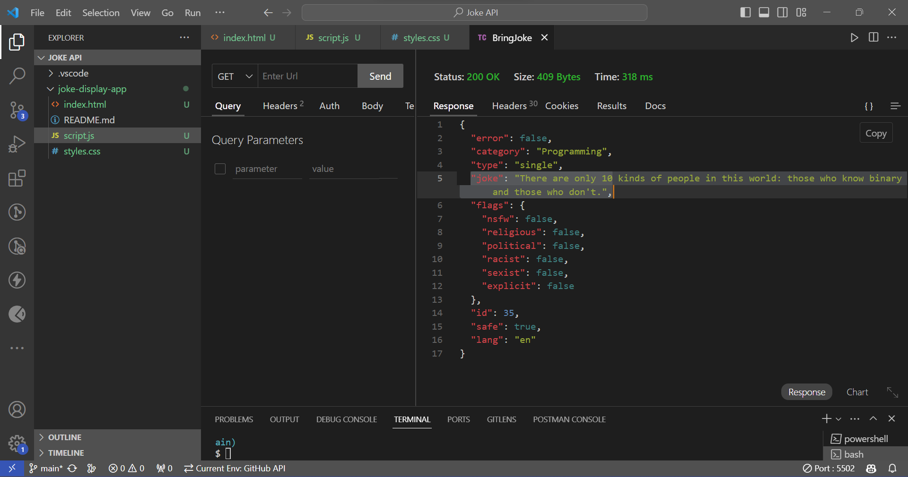

# joke-display-app
## Objective
- Create a JavaScript application that integrates with the Joke API to fetch and display jokes dynamically. This assignment aims to reinforce your skills in making API requests, handling JSON data, and dynamically updating the DOM.## 

## Description of change BG color function.

This code defines a JavaScript function called `changeBodyColor()`

1. `const randomColor = '#' + Math.floor(Math.random() * 16777215).toString(16);`: This line generates a random hexadecimal color code. Here's how it works:

   - `Math.random()`: This function generates a random floating-point number between 0 (inclusive) and 1 (exclusive).

   - `Math.floor()`: This function rounds down the decimal number generated by `Math.random()` to the nearest integer.

   - `* 16777215`: This multiplier is used to generate a random number within the range of possible hexadecimal color codes (from `000000` to `FFFFFF`). This number represents the maximum value that can be represented by a six-digit hexadecimal color code.

   - `.toString(16)`: This converts the generated random number into a hexadecimal string. The parameter `16` specifies that the conversion should be to base-16 (hexadecimal).

2. `document.body.style.backgroundColor = randomColor;`: This line sets the `backgroundColor` style property of the `<body>` element of the HTML document to the randomly generated color. This effectively changes the background color of the entire webpage to the randomly chosen color whenever this function is called.

So, when you call the `changeBodyColor()` function, it generates a random color code and sets the background color of the webpage to that color.